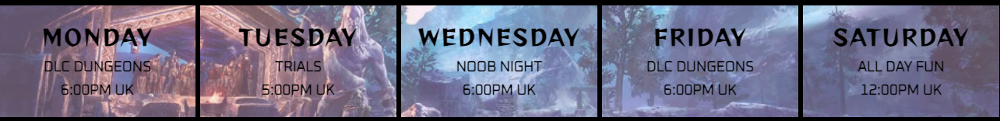

# Gay Street Gamers

The live website can be found [here](https://charlie-vf.github.io/gay-street-games/).
 
*In this README, I use 'Elder Scrolls Online' and its acronym, 'ESO', interchangeably.*

## Table of Contents

- [Purpose](#purpose)
- [User Stories](#user-stories)
- [Design](#design)
    - [Images](#images)
    - [Colors](#colors)
    - [Fonts](#fonts)
- [Features](#features)
    - [Nav Bar](#navigation-bar)
    - [Hero Images](#hero-images)
    - [Home Page](#home)
        - [Events](#events)
    - [About Us Page](#about-us)
    - [Contact Us Page](#contact-us)
    - [Footer](#footer)
- [Technologies](#technologies)
- [Testing](#testing)
- [Validation & Accesibility](#validation--accessibility)
- [Issues & Fixes](#issues--fixes)
- [Deployment](#deployment)
- [Future Instalments](#future-instalments)
- [Credits](#credits)

## **Purpose**

Gay Street Gamers is a site made by Elder Scrolls Online gamers for Elder Scrolls Online gamers. It serves the dual purpose of promoting the Twitch channel and other social medias of the team running the site, as well as providing a place for players to get information on the game, watch others play difficult content and ask questions to experienced players. 

## **User Design and Experience**

## User Stories

### First Time Visitor goals

- As a First Time Visitor, I want to understand what the website is for and why
- As a First Time Visitor, I want to easily navigate through the different pages on the site to find the content I want.
- As a First Time Visitor, I want to be able to find information on ESO as a game
- As a First Time Visitor, I want to easily see what events are running during the week

### Returning Visitor goals

- As a Returning Visitor, I want to learn more about the team behind the site
- As a Returning Visitor, I want to be able to contact the team with queries and requests for help

### Frequent Visitor goals

- As a Frequent Visitor, I want to see if there are any changes to the weekly events schedule
- As a Frequent Visitor, I want to see if there is any new content in the game

## Design

### Images

All the images used on the site are related to the Elder Scrolls Online, and not just video gaming in general. I chose specific images I felt reflected the beauty of the game, both in character design and landscaping, lighting, colors etc.
For example, the center circle image on the homepage is The Prophet, a prominent character in the Main Story of the game; and the header image on the About Us page is of Fennorian, a character from 2020's DLC release - Greymoor - and a player character. 
The color theme of the images matches that of the site as a whole, which is focussed around purples and blues.

### Colors

The main colors used on the site are purples, with some blues, against a black page background.

Purple:
- #ca92e0 is used for most of the body text and the menu links
- #905ce2 is used for the headings, site logo & social media links

The original color used for headings was #6738b3, however after putting the site through an accessibility validator, this proved too dark a shade against the black background. Changing to #905ce2 increased the color contrast ratio from 2.9 to just over 4.5.

Variations on the above colors were used where the colors of the background images required it for visual accessibility, including using rgb opacity values and opting for black where it was the best choice.

Blue:
- #a8d2d2 is used in the image-text for the About Us and Contact Us pages

### Fonts

The fonts used in this website are Reggae One for the logo, main section headings and the days in the events section; and Oxanium for the text over the images,lower tier headings and body text. I experimented with some fonts which were close to what is used in ESO and other Elder Scrolls games, but found they impacted the readability of the text on the website, and thus chose to focus on imagery to give users a taste of what ESO is like, visually.
I used text transform to make the headings and links uppercase for contrast.
I also used text zoom for most of the information text as I thought this was a fun feature to experiment with and it adds an extra level of interactivity which I believe gamers will subconsciously enjoy. It also helps with focussing on text. I added a media query for disabling this animation if the user has specified they prefer reduced motion.

## **Features**

## Existing Features

### Navigation Bar

The fully responsive navigation bar features a logo which links back to the homepage, as well as links to the home, about us and contact us pages. It is the same on each page and includes a background highlight on hover and active underline features so its clear to the user where they're going and where they are. There is no need to use the brower's back button to navigate the website.

### Hero Images

Each page features a full-width image from the Elder Scrolls Online with image text over it providing a short description of what the page is about.
I chose to continue the theme of a large image across all three pages as I found it satisfying when switching between pages to not have a sudden change in page layout. On full screen displays, the image leaves space at the bottom allowing the first of that page's headings to be visible, encouraging the user to scroll down to see the content. 

### Home

The homepage provides background information on what the Elder Scrolls Online is and what's currently happening in the game, as well as telling the user about that week's upcoming events in the club.
The layout of the "What is Elder Scrolls Online?" section is inspired by the Love Running project as I really enjoyed this layout and the placement of a focus image between text. 

I chose to provide a link to an external page in the Chapter DLC section of the homepage as I felt it redundant to include all the information about the High Isles DLC in my own website as there are other sites which have already gone ahead and done that; and also that simply giving an overview of the Chapter's main features fit better with the overall content inclusion on my site. 

### Events

The week events section will be continously updated and details what is focussed on in each Twitch session.
Again, the layout of this section was inspired by the Love Running project as that is where I learnt how to position a series of divs horizontally across a single background image. 

### About Us

The about us page introduces the user to the team behind the site and why they've chosen to come together to make a collaborative place for players both new and experienced.

### Contact Us

The contact us page provides a form for users to send any questions they may have to the team. The form has three checkbox options to help categorise the query.
The page features an aside, explaining to users what sort of things they can expect help with and what is dependent on the platform they game on. 

### Footer

The footer is the same across all three pages and features links to the teams' Twitch, Discord, Twitter, YouTube and Instagram pages.

## **Technologies**

- HTML: The main language of the project for providing structure and content
- CSS: Adds custom styling and personality to the page
- [Google Fonts](https://fonts.google.com/): Used to import the "Reggae One" and "Oxanium" fonts
- [TinyPNG](https://tinypng.com/): Used to compress the file sizes of the images on the site
- [Font Awesome](https://fontawesome.com/): Supplied the icons used in the Footer for social media links
- [Am I Responsive?](http://ami.responsivedesign.is/): Generated website mockup across devices

### **Website Mockup**

## **Testing**

- I ensured the site works across all screen sizes, from widescreen to mobile, using DevTools.
- I tested the site on my own mobile and my friends' to double check responsiveness
- I ensured the form submits properly and requires input in the relevant fields
- I ensured all links work correctly and open in new tabs

## **Validation & Accessibility**

- Passes W3C HTML Validator with no errors returned
- Passes W3C CSS Validator with no errors returned
- I used the [PowerMapper](https://www.powermapper.com/) Web Accessibility tool to provide detailed information on any accessibility issues with my HTML and CSS, and fixed them accordingly
    - I then used DevTools' Lighthouse feature to double check accessibility was 100%

## **Issues & Fixes**

When viewed on mobile, the checkboxes on the form page overlapped their respective text. I fixed this by changing the
margin size between checkbox and text for smaller screens.

## **Deployment**

This website was deployed using GitHub pages. The steps to achieve this are:
- In the GitHub repository, navigate to Settings
- Select Pages from the left-hand navigation bar
- Select branch:main and folder:/root and hit Save
- A link to the live website is provided

## **Future Instalments**

- The checkboxes on the form are not required to be checked in order for the form to be submitted, unlike the text fields, as HTML5 doesn't allow the instruction of at least one box needing to be checked amongst multiple.
Once I've learnt the relevant material, I'll add this feature to the boxes.
- I would like to add another page more dedicated to the Twitch side of the group, with video clips and
links to individual channels, however time constraints and priority management did not allow me to do this.

## **Credits**

### **Sites That Helped Me Out**
- [This site](https://developer.mozilla.org/en-US/docs/Web/CSS/CSS_Grid_Layout/Grid_Template_Areas) taught me how to use Grid Template Areas
- [This site](https://developer.mozilla.org/en-US/docs/Web/CSS/@media/prefers-reduced-motion) taught me about Reduced Motion inclusion
- [This site](https://css-tricks.com/snippets/css/scale-on-hover-with-webkit-transition/) helped with text zoom on hover
- [This site](https://benevolentbowd.ca/games/esotu/eso-teases-upcoming-event-zeal-of-zenithar/#:~:text=The%20Anniversary%20event%20was%20not,or%20involve%20the%20guild%20traders.) provided information on the Zeal of Zenithar event

### **Image Sources**
All images were taken from Google. I would have liked to use screenshots of the game which I took personally, however the quality of screenshots on PlayStation is incredibly poor. 

### **Acknowledgements**

A big thank you to my mentor, Brian Macharia, for motivating and educating me throughout the project. 